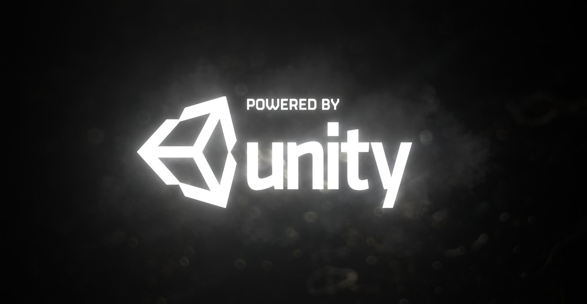
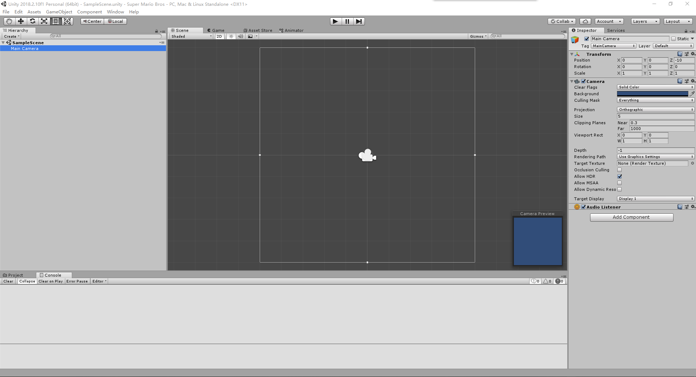
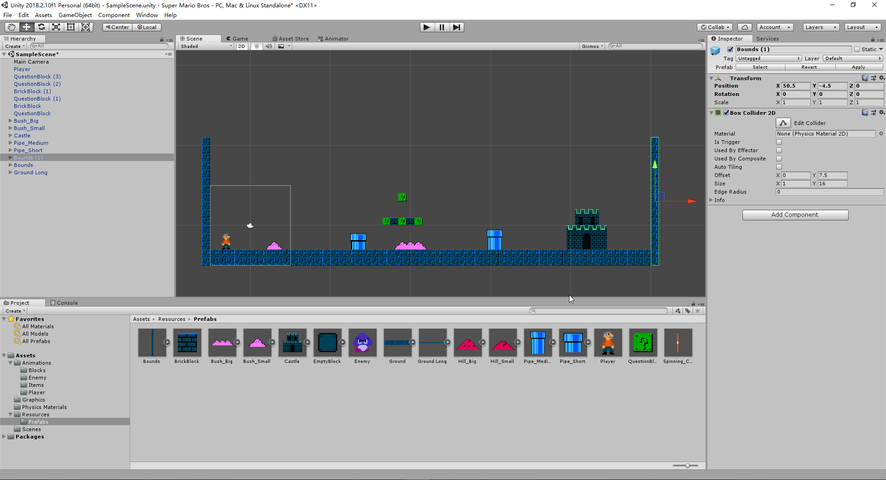

# NTUOSS Unity Workshop

##### *made with love by [Yong Hao](https://github.com/HORACEYOUNG) for NTU Open Source Society*

---

### Workshop Details

**When**: Friday, 12 Oct 2018. 6:30 PM - 8:30 PM.
**Where**: LT1, NTU North Spine Plaza
**Who**: NTU Open Source Society

**Questions**: We will be hosting a Pigeon Hole Live for collecting questions regarding the workshop.

Feedback & Error Reports: We will send out the link for collecting feedback as usual.
​	For further discussion or cooperation please contact YO0001AO@e.ntu.edu.sg.

***Disclaimer: This workshop is for educational purposes only. The artistic resources are retrieved from Nintendo Co., Ltd. and information regarding Unity concepts are retrieved from [Unity Manual](https://docs.unity3d.com/Manual/index.html). No prototype or outcome of any type is intended for commercial use.***

Tip: Search this Document with UnityConcept: “Search Term” to look for explanation. (First Letter Capitalized)
Eg. “UnityConcept: Asset”

---
### Prerequisites

1. **Unity Game Engine Software**

   [You can download Unity Personal Version by clicking this link.](https://store.unity.com/download?ref=personal)

   Unity Personal Version is free as long as the organization of the user does not make more than $100k in annual gross revenues.

   **Warning: We highly recommend you to download unity prior to coming to this workshop as it may take 30 - 60 minutes to complete the download. Also please register an account with Unity to login to the Unity software.**

2. **Visual Studio 2017 (or any other IDE you like for C# language)**

   Visual Studio 2017 is an integrated development environment (IDE) from Microsoft.

   As Unity Engine is based on C# language, Visual Studio 2017 serves this cause.

   We would recommend using Visual Studio 2017 for consistency because the speaker would use it and to prevent possible misunderstandings.

3. **Basic Object-Oriented Programming Knowledge (optional)**

---
## Task 0. Introduction

### What is Unity?

##### Unity is An all-in-one Editor that extends to match your production workflow

The Unity Editor features multiple tools that enable rapid editing and iteration in your development cycles, including Play mode for quick previews of your work in real-time.

- **All-in-one editor:** Available on Windows and Mac, it includes a range of artist-friendly tools for designing immersive experiences and game worlds, as well as a strong suite of developer tools for implementing game logic and high-performance gameplay.

- **2D & 3D:** Unity supports both 2D and 3D development with features and functionality for your specific needs across genres.

- **AI pathfinding tools:** Unity includes a navigation system that allows you to create NPCs that can intelligently move around the game world. The system uses navigation meshes that are created automatically from your Scene geometry, or even dynamic obstacles, to alter the navigation of the characters at runtime.

- **User interfaces:** Our built-in UI system allows you to create user interfaces fast and intuitively.

- **Physics engines:** Take advantage of Box2D and NVIDIA PhysX support for highly realistic and high-performance gameplay.

- **Custom tools:** You can extend the Editor with whatever tools you need to match your team’s workflow. Create and add customized extensions or find what you need on our Asset Store, which features thousands of resources, tools and extensions to speed up your projects.

### *Nearly Half of the games are made by Unity (Source: Unity Department of Propaganda)*
---
## Task 1. Create your first Project

​	When you first open unity, unity will ask you to log in (please register an account prior to the workshop or login with google or facebook accounts). 
​	

​	After you've logged in, you will be directed to the list of existing projects both local and on cloud, here we click on the **New** button to create a new project.

​	

​	The following information is required to create a new project:

- Project name: the name of your project;

- Location: where you want your project to be stored;

- Organization: which organization you belong to. Unity might use this data for its own business analytics.

- Template: the template for your game, available options can be 2D, 3D, 3D with extras etc. 

  Important: For this workshop, we will be using 2D template, make sure you have chosen the correct template.

- Add Asset Package: select the asset packages you want to initialize along with the project. Asset packages are collections of resources such as models, animations and audio for unity development use. For this tutorial we can ignore this since we will be manually importing our assets.

  With all information set, click on “Create Project” and let’s rock!

​	A new Unity window of your project will be opened. This could take a few seconds to minutes. It might seem overwhelming at first but don’t worry, we’ll go through them one by one.

---

## Task 2. Import Assets and Build the Scene

### [UnityConcept: Asset Package](https://docs.unity3d.com/Manual/AssetPackages.html)

> **Unity Asset Packages** and items on the Unity **Asset Store** are supplied in packages, which are **collections of files and data from Unity Projects**, or elements of Projects, which **are compressed and stored in one file**, similar to zip files. Like zip files.

​	For this Workshop, we will be using an online package called [MarioCloneAssets.unitypackage](https://github.com/HORACEYOUNG/NTUOSS-UnityWorkshop/blob/master/MarioCloneAssets.unitypackage) under the root directory of the [workshop repository](https://github.com/HORACEYOUNG/NTUOSS-UnityWorkshop).

### Task2.1. Import the Asset Package to Your Project

There are to ways to import an asset package to your project:

1. From the top menu bar, choose Assets >> Import Package >> Custom Package

Find the directory of [MarioCloneAssets.unitypackage](https://github.com/HORACEYOUNG/NTUOSS-UnityWorkshop/blob/master/MarioCloneAssets.unitypackage) and double click it, a window below is about to show up:

​	From the above we can see that we could choose the assets that we want to import to out project. We select all and click import because we are eventually going to need them all.

​	Upon finishing, you should be able to see a few new folders appear at the bottom under the root “Asset”. This block is where we will be managing all our assets.
### Task2.2. Set Up the Scene for Our Game
### [UnityConcept: Scene](https://docs.unity3d.com/Manual/CreatingScenes.html)
> **Scenes** contain the environments and menus of your game. Think of each unique **Scene** file as a unique level. 
>
> In each **Scene**, you place your environments, obstacles, and decorations, essentially designing and building your game in pieces.

​	Now it’s time for us to add our models and elements to populate our scene, a scene is like a stage in the theater for GameObjects to perform their functionalities.

How exactly are we going to introduce our main character - - Super Mario to our scene? Now navigate to the Assets >> Resources >> Prefabs and drag the prefab you wanted to the scene.
### [UnityConcept: Prefab](https://docs.unity3d.com/Manual/Prefabs.html)
> The **prefab** acts as a template from which you can create new object instances in the scene. 
>
> Any edits made to a **prefab asset** are immediately reflected in all instances produced from it but you can also override components and settings for each instance individually.

By dragging the prefab into the scene, a few changes can be observed.

First, under the hierarchy >> the current scene, a GameObject has been created. 

Dragging a prefab into the scene is a way to create game objects. There are many other ways to do it, I’ll leave it to you to explore.

Secondly, when you click on the newly created Player GameObject, the inspector on the right-hand side begin to display the information about this GameObject.

In Unity, every object is a GameObject. They possess certain properties like position, scale, rotation, lighting or color, and containing other components, for example, a rigidBody to apply force to, or a collider to detect collision.

There are many components that a GameObject can possess, for now our main focus will be on the component named “Transform”.

### [UnityConcept: Transform](https://docs.unity3d.com/Manual/class-Transform.html)
> The Transform component determines the Position, Rotation, and Scale of each object in the scene. 
>
> Every GameObject has a Transform.

The position of transform indicates the relative position the object is in regard of the scene, we could change the values by manipulating the corresponding x, y, and z value of the position (For a 2D project we only care about x and y, ignoring the z-axis).

 Now please drag the following prefabs to the scene and set them to the corresponding location given below:

1. Main Camera (0, 0, 0)
2. Player (-3, -2, 0)
3. Ground Long (-4.5, -4.5, 0)
4. Two Bound: (-5.5, -4.5 , 0) and (50.5, -4.5, 0)
5. A few other decorations which I will address shortly.

If the scene is set properly, the scene view should be like this:

Now we’re all set and comes the most exciting part: coding!

---

## Task 3. Write Scripts for Player Motion

Now let’s get our hands on the most important concept in Unity: ***Script***

The behavior of **GameObjects**
 is controlled by the **Components**
 that are attached to them. Although Unity’s built-in Components can be very versatile, you will soon find you need to go beyond what they can provide to implement your own gameplay features. 

### [UnityConcept: Scripts](https://docs.unity3d.com/Manual/CreatingAndUsingScripts.html)

> Unity allows you to create your own Components using scripts. These allow you to trigger game events, modify Component properties over time and respond to user input in any way you like.
>
> Unity supports the C# programming language natively. C# (pronounced C-sharp) is an industry-standard language similar to Java or C++.

For convenience, let’s create a new folder called “Scripts” and create the scripts we will need for the following session: (We'll address them in order)

1. Player
2. CameraFollow
3. EnemyAI
4. QuestionBlock
5. Castle

If you are doing properly, your script folder should be like this:

