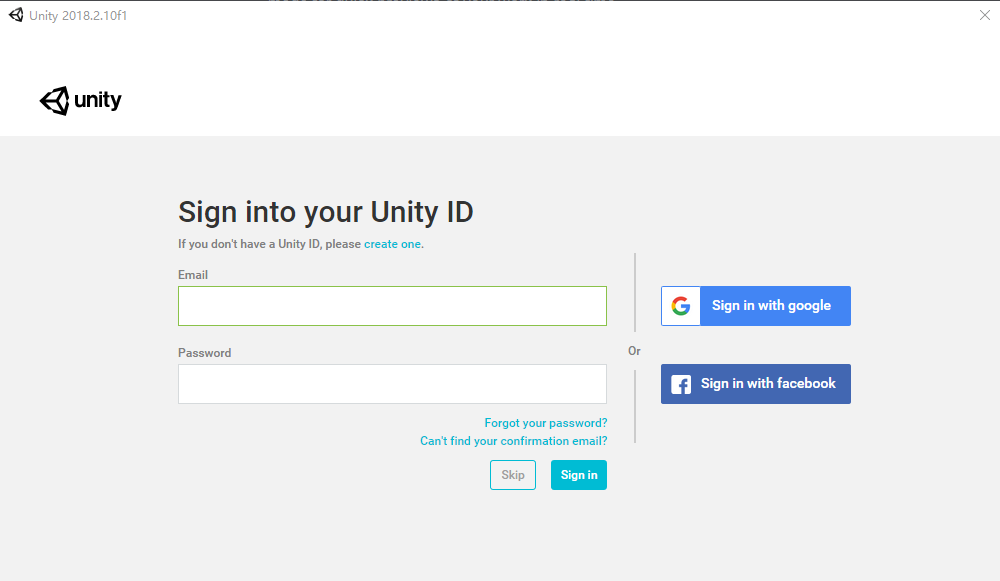
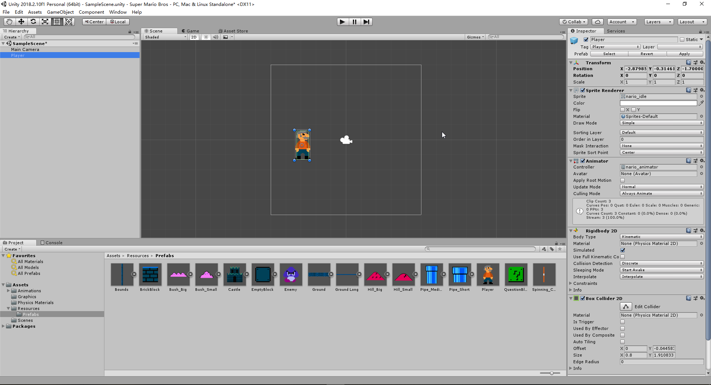
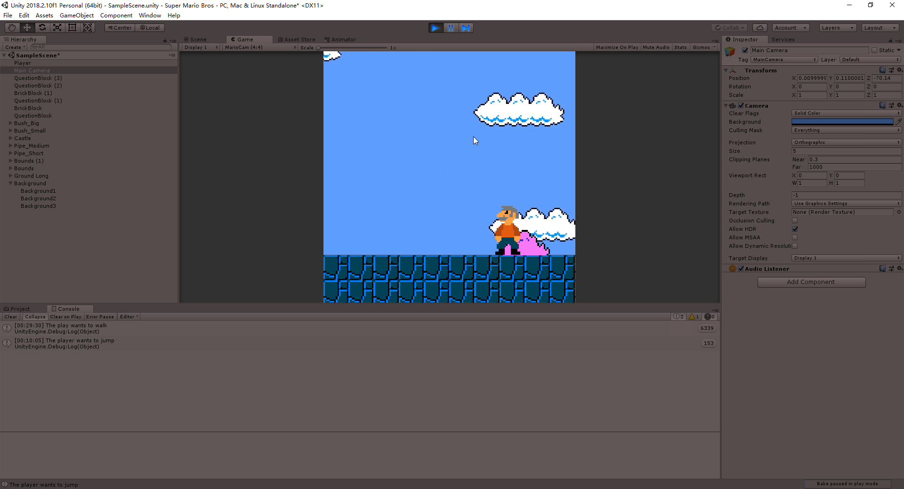
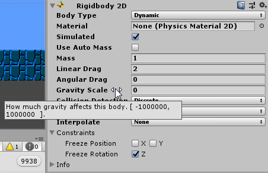
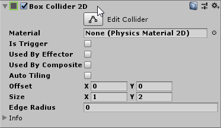
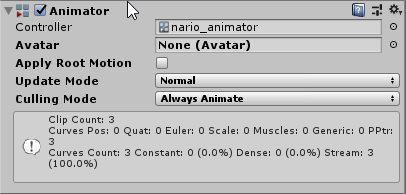
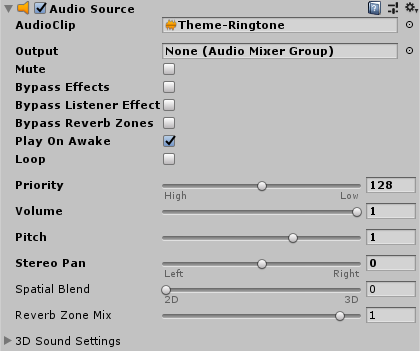
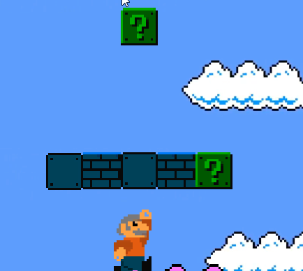
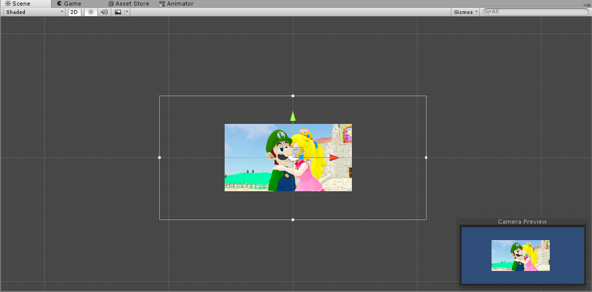

# NTUOSS Unity Workshop

##### *made with love by [Yong Hao](https://github.com/HORACEYOUNG) for NTU Open Source Society*

*Leave a star if you like this~*


---

### Workshop Details

**When**: Friday, 12 Oct 2018. 6:30 PM - 8:30 PM.
**Where**: LT1, NTU North Spine Plaza
**Who**: NTU Open Source Society

**Questions**: We will be hosting a Pigeon Hole Live for collecting questions regarding the workshop.

Feedback & Error Reports: We will send out the link for collecting feedback as usual.
​	For further discussion or cooperation please contact YO0001AO@e.ntu.edu.sg.

***Disclaimer: This workshop is for educational purposes only. The artistic resources are retrieved from Nintendo Co., Ltd. and information regarding Unity concepts are retrieved from [Unity Manual](https://docs.unity3d.com/Manual/index.html). No prototype or outcome of any type is intended for commercial use.***

Tip: Search this Document with “UnityConcept: ‘Search Term’“ and “UnityDoc: ‘Search Term’” to look for explanation. (First Letter Capitalized)
Eg. “UnityConcept: Asset” / “UnityDoc: GetKey”

---
### Prerequisites

1. **Unity Game Engine Software**

   [You can download Unity Personal Version by clicking this link.](https://store.unity.com/download?ref=personal)

   Unity Personal Version is free as long as the organization of the user does not make more than $100k in annual gross revenues.

   **Warning: We highly recommend you to download unity prior to coming to this workshop as it may take 30 - 60 minutes to complete the download. Also please register an account with Unity to login to the Unity software.**

2. **Visual Studio 2017 (or any other IDE you like for C# language)**

   Visual Studio 2017 is an integrated development environment (IDE) from Microsoft.

   As Unity Engine is based on C# language, Visual Studio 2017 serves this cause.

   We would recommend using Visual Studio 2017 for consistency because the speaker would use it and to prevent possible misunderstandings.

3. **Basic Object-Oriented Programming Knowledge (optional)**

---
## Task 0. Introduction

### What is Unity?


##### Unity is An all-in-one Editor that extends to match your production workflow

The Unity Editor features multiple tools that enable rapid editing and iteration in your development cycles, including Play mode for quick previews of your work in real-time.

- **All-in-one editor:** Available on Windows and Mac, it includes a range of artist-friendly tools for designing immersive experiences and game worlds, as well as a strong suite of developer tools for implementing game logic and high-performance gameplay.

- **2D & 3D:** Unity supports both 2D and 3D development with features and functionality for your specific needs across genres.

- **AI pathfinding tools:** Unity includes a navigation system that allows you to create NPCs that can intelligently move around the game world. The system uses navigation meshes that are created automatically from your Scene geometry, or even dynamic obstacles, to alter the navigation of the characters at runtime.

- **User interfaces:** Our built-in UI system allows you to create user interfaces fast and intuitively.

- **Physics engines:** Take advantage of Box2D and NVIDIA PhysX support for highly realistic and high-performance gameplay.

- **Custom tools:** You can extend the Editor with whatever tools you need to match your team’s workflow. Create and add customized extensions or find what you need on our Asset Store, which features thousands of resources, tools and extensions to speed up your projects.

### *Nearly Half of the games are made by Unity (Source: Unity Department of Propaganda)*
---
## Task 1. Create your first Project

​	When you first open unity, unity will ask you to log in (please register an account prior to the workshop or login with google or facebook accounts). 
​	

​	After you've logged in, you will be directed to the list of existing projects both local and on cloud, here we click on the **New** button to create a new project.

​	

​	The following information is required to create a new project:

- Project name: the name of your project;

- Location: where you want your project to be stored;

- Organization: which organization you belong to. Unity might use this data for its own business analytics.

- Template: the template for your game, available options can be 2D, 3D, 3D with extras etc. 

  Important: For this workshop, we will be using 2D template, make sure you have chosen the correct template.

- Add Asset Package: select the asset packages you want to initialize along with the project. Asset packages are collections of resources such as models, animations and audio for unity development use. For this tutorial we can ignore this since we will be manually importing our assets.

  With all information set, click on “Create Project” and let’s rock!

​	A new Unity window of your project will be opened. This could take a few seconds to minutes. It might seem overwhelming at first but don’t worry, we’ll go through them one by one.


---

## Task 2. Import Assets and Build the Scene

### [UnityConcept: Asset Package](https://docs.unity3d.com/Manual/AssetPackages.html)

> **Unity Asset Packages** and items on the Unity **Asset Store** are supplied in packages, which are **collections of files and data from Unity Projects**, or elements of Projects, which **are compressed and stored in one file**, similar to zip files. Like zip files.

​	For this Workshop, we will be using an online package called [MarioCloneAssets.unitypackage](https://github.com/HORACEYOUNG/NTUOSS-UnityWorkshop/blob/master/MarioCloneAssets.unitypackage) under the root directory of the [workshop repository](https://github.com/HORACEYOUNG/NTUOSS-UnityWorkshop).


### Task2.1. Import the Asset Package to Your Project

There are to ways to import an asset package to your project:

1. From the top menu bar, choose Assets >> Import Package >> Custom Package


Find the directory of [MarioCloneAssets.unitypackage](https://github.com/HORACEYOUNG/NTUOSS-UnityWorkshop/blob/master/MarioCloneAssets.unitypackage) and double click it, a window below is about to show up:


​	From the above we can see that we could choose the assets that we want to import to out project. We select all and click import because we are eventually going to need them all.


​	Upon finishing, you should be able to see a few new folders appear at the bottom under the root “Asset”. This block is where we will be managing all our assets.
### Task2.2. Set Up the Scene for Our Game
### [UnityConcept: Scene](https://docs.unity3d.com/Manual/CreatingScenes.html)
> **Scenes** contain the environments and menus of your game. Think of each unique **Scene** file as a unique level. 
>
> In each **Scene**, you place your environments, obstacles, and decorations, essentially designing and building your game in pieces.

​	Now it’s time for us to add our models and elements to populate our scene, a scene is like a stage in the theater for GameObjects to perform their functionalities.

How exactly are we going to introduce our main character - - Super Mario to our scene? Now navigate to the Assets >> Resources >> Prefabs and drag the prefab you wanted to the scene.
### [UnityConcept: Prefab](https://docs.unity3d.com/Manual/Prefabs.html)
> The **prefab** acts as a template from which you can create new object instances in the scene. 
>
> Any edits made to a **prefab asset** are immediately reflected in all instances produced from it but you can also override components and settings for each instance individually.

By dragging the prefab into the scene, a few changes can be observed.

First, under the hierarchy >> the current scene, a GameObject has been created. 

Dragging a prefab into the scene is a way to create game objects. There are many other ways to do it, I’ll leave it to you to explore.



Secondly, when you click on the newly created Player GameObject, the inspector on the right-hand side begin to display the information about this GameObject.

In Unity, every object is a GameObject. They possess certain properties like position, scale, rotation, lighting or color, and containing other components, for example, a rigidBody to apply force to, or a collider to detect collision.

There are many components that a GameObject can possess, for now our main focus will be on the component named “Transform”.

### [UnityConcept: Transform](https://docs.unity3d.com/Manual/class-Transform.html)
> The Transform component determines the Position, Rotation, and Scale of each object in the scene. 
>
> Every GameObject has a Transform.


The position of transform indicates the relative position the object is in regard of the scene, we could change the values by manipulating the corresponding x, y, and z value of the position (For a 2D project we only care about x and y, ignoring the z-axis).

 Now please drag the following prefabs to the scene and set them to the corresponding location given below:

1. Main Camera (0, 0, -30)
2. Player (-3, -2, 0)
3. Ground Long (-4.5, -4.5, 0)
4. Two Bound: (-5.5, -4.5 , 0) and (50.5, -4.5, 0)
5. A few other decorations which I will address shortly.

If the scene is set properly, the scene view should be like this:


Now we’re all set and comes the most exciting part: coding!

---

## Task 3. Write Scripts for Player Motion

Now let’s get our hands on the most important concept in Unity: ***Script***

The behavior of **GameObjects**
 is controlled by the **Components**
 that are attached to them. Although Unity’s built-in Components can be very versatile, you will soon find you need to go beyond what they can provide to implement your own gameplay features. 

### [UnityConcept: Scripts](https://docs.unity3d.com/Manual/CreatingAndUsingScripts.html)

> Unity allows you to create your own Components using scripts. These allow you to trigger game events, modify Component properties over time and respond to user input in any way you like.
>
> Unity supports the C# programming language natively. C# (pronounced C-sharp) is an industry-standard language similar to Java or C++.

For convenience, let’s create a new folder called “Scripts” and create the scripts we will need for the following session: (We'll address them in order)

1. Player
2. CameraFollow
3. EnemyAI
4. QuestionBlock
5. Castle

If you are doing properly, your script folder should be like this:


Now let’s see the template of a script:

```c#
using System.Collections;
using System.Collections.Generic;
using UnityEngine;

public class Player : MonoBehaviour { 


    // Use this for initialization
    // Start is called when the game object is created, it's often used for initialization of variables.
    void Start () {

    }

    // The functions inside of Update() will be called once per frame
    // Games today could reach 60 frames per second, meaning Update() can be called for dozens of times per second.
    void Update () {
        
    }
}
```

A script inherits from the class MonoBehaviour, which is a blueprint for components to be attached to GameObjects.

### Task 3.1. Player Movement

*Additional Notes for people who are not familiar with **object-oriented programming**:*

When declaring variables, the access modifiers - - **Private and Public**, let the compiler know which classes should have access to the field:

**private** - Only the current class will have access to the field or method.  
**public** - Any class can refer to the field or call the method.

How does these two reflect differently in Unity?

If I create a public integer variable called *velocity* in the scripts, I can actually modify this variable in Unity to test different velocity (see the image below):

```c#
public int velocity; // Do not initialize the value.
```


Whereas private variables will only be accessible with the script. For testing purposes, you can declare a certain variables to see if they’re function well, but remember to set them to private for information security purpose.  

---

To enable the player to move, we are going to get the player input by GetKey methods and Addforce to the player’s RigidBody:

Firstly let’s declare the necessary variables:

```c#
public Vector2 velocity; // Store the velocity of Player horizontally and vertically

private float horizontalVelocityLimit; // Set a limit to Player's maximum horizontal velocity

private bool walk, walkLeft, walkRight, jump; // State Boolean variables to record the state of the player

private enum PlayerState // Enum is a set of state variables
{
    idle,
    walking,
    jumping
}

PlayerState playerState; // Player state to keep track of

private Rigidbody2D playerRb;       //Store a reference to the Rigidbody2D component required to use 2D Physics.
```

We will update the Boolean values of walk, walkLeft, walkRight and jump using GetKey method of Unity:

##### [UnityDoc: Input.GetKey](https://docs.unity3d.com/ScriptReference/Input.GetKey.html)

```c#
public static bool GetKey(KeyCode key);
// Returns true while the user holds down the key identified by the key KeyCode enum parameter
```

There are other two types of methods to get keyboard input from the user:

| Method Name | Description                                                  |
| :---------- | ------------------------------------------------------------ |
| GetKeyDown  | Returns true during the frame the user starts pressing down the key identified by name (Only for one frame). |
| GetKey      | Returns true during the frame the user releases the key identified by name (Only for one frame). |
| GetKey      | Returns true while the user holds down the key identified by the key KeyCode enum parameter |

Now let’s finish the method for receiving input:

```c#
void CheckPlayerInput()
{
    // Declare three bools to check the state of keyboard input
    bool input_left = Input.GetKey(KeyCode.LeftArrow);
    bool input_right = Input.GetKey(KeyCode.RightArrow);
    bool input_space = Input.GetKeyDown(KeyCode.Space);

    walk = input_left || input_right; // The player is walking when it's either walking left/right

    walkLeft = input_left && !input_right;

    walkRight = !input_left && input_right;

    jump = input_space; // The player will jump is space is pressed
}
```

After we’ve acquired the user input state, we are going to apply force to the player accordingly.

We’re going to use the AddForce Method to the player’s rigidbody.

##### [UnityDoc: RigidBody2D](https://docs.unity3d.com/ScriptReference/Rigidbody2D.html)

> The Rigidbody2D class essentially provides the same functionality in 2D that the Rigidbody class provides in 3D. 
>
> Adding a Rigidbody2D component to a GameObject puts it under the control of the physics engine.

By itself, this means that the **sprite will be affected by gravity and can be controlled from scripts using forces**. By adding the appropriate collider component, the sprite will also respond to collisions with other sprites.

##### [UnityDoc: RigidBody2D.AddForce](https://docs.unity3d.com/ScriptReference/Rigidbody2D.AddForce.html)

```c#
public void AddForce(Vector2 force, ForceMode2D mode = ForceMode2D.Force);
// For this workshop we only care about the first parameter "Vector2 force"
```

Write the following codes to apply forces to the player:

```c#
void ApplyForceToPlayer()
{

    Vector3 scale = transform.localScale; // Reference Player's scale


    CheckPlayerInput(); // Check the Player's input here

    if (walk)
    {
        Debug.Log("The play wants to walk"); // Log is useful for debugging

        if (walkLeft)
        {
        playerRb.AddForce(Vector2.left * velocity.x); // Apply the force to the player
        scale.x = -1; // Change the direction the player is facing
        }
        else if (walkRight)
        {
        playerRb.AddForce(Vector2.right * velocity.x);
        scale.x = 1;
        }
	}
}
```

The logic is very simple and plain: if the player wants to walk, we will know which direction the player wants to walk, and apply the force according to the direction. Because a Vector 2 contains both magnitude and direction (specified by positive and negative value) info, the player will move exactly how we want it to.

##### [UnityDoc: GetComponent](https://docs.unity3d.com/ScriptReference/Component.GetComponent.html

> ```c#
> public Component GetComponent(Type type);
> ```
>
> Returns the component of Type `type` if the game object has one attached, null if it doesn't.
>
> E.g. 
>
> ```c#
> RigidBody2D rb = GetComponent<RigidBody>();
> ```
>
>

And don’t forget to invoke both methods in the correct place: invoke CheckPlayerInput() inside ApplyForceToPlayer() and invoke ApplyForceToPlayer() in the FixedUpdate(), the final outcome should look like this:

```c#
using System.Collections;
using System.Collections.Generic;
using UnityEngine;

public class Player : MonoBehaviour
{
    public Vector2 velocity;             // Store the velocity of Player horizontally and vertically
    private float horizontalVelocityLimit; // Set a limit to Player's maximum horizontal velocity
    private bool walk, walkLeft, walkRight, jump; // State Boolean variables to record the state of the player

    public enum PlayerState // Enum is a set of state variables
    {
        idle,
        walking,
        jumping
    }

    public PlayerState playerState; // Player state to keep track of

    private Rigidbody2D playerRb;  //Store a reference to the Rigidbody2D component required to use 2D Physics.

    // Use this for initialization
    void Start()
    {
        //Get and store a reference to the Rigidbody2D component so that we can access it.
        playerRb = GetComponent<Rigidbody2D>();
        playerState = PlayerState.idle;
    }

    void Update()
    {
        UpdatePlayerState(); // Update player State
        UpdatePlayerAnimation(); // Because Animation is not related to Physics, update under Update()
    }

    //FixedUpdate is called at a fixed interval and is independent of frame rate. Put physics code here.
    void FixedUpdate()
    {
        ApplyForceToPlayer(); // Call the ApplyForceToPlayer() here
    }

    void ApplyForceToPlayer()
    {

        Vector3 scale = transform.localScale; // Reference Player's scale

        CheckPlayerInput(); // Check the Player's input here

        if (walk)
        {
            Debug.Log("The play wants to walk"); // Log is useful for debugging

            if (walkLeft)
            {
                playerRb.AddForce(Vector2.left * velocity.x); // Apply the force to the player
                scale.x = -1; // Change the direction the player is facing
            }
            else if (walkRight)
            {
                playerRb.AddForce(Vector2.right * velocity.x);
                scale.x = 1;
            }

        }

        if (jump)
        {
            Debug.Log("The player wants to jump");
            Vector2 tempVelocity = playerRb.velocity; // Store the current velocity for we want the current horizontal velocity not to change
            playerRb.velocity = new Vector2(tempVelocity.x, velocity.y); // Give the rigidbody an initial vertical velocity
        }


        transform.localScale = scale; // Update Player's Tranform.scale Here
    }

    void CheckPlayerInput()
    {
        // Declare three bools to check the state of keyboard input
        bool input_left = Input.GetKey(KeyCode.LeftArrow);
        bool input_right = Input.GetKey(KeyCode.RightArrow);
        bool input_space = Input.GetKeyDown(KeyCode.Space);

        walk = input_left || input_right; // The player is walking when it's either walking left/right

        walkLeft = input_left && !input_right;

        walkRight = !input_left && input_right;

        jump = input_space; // The player will jump is space is pressed
    }

    void UpdatePlayerState()
    {
        if (playerRb.velocity.y != 0) // If the player has a vertical velocity, meaning the player is in the air
        {
            playerState = PlayerState.jumping; // Change the player's state
        }
        else if(playerRb.velocity.x != 0) // If the player has a horizontal velocity but no vertical, meaning the player is walking
        {
            playerState = PlayerState.walking;
        }
        else // Else the player is idle
        {
            playerState = PlayerState.idle;
        }
    }
}
```

And don’t forget to set the velocity value in Unity, otherwise it will be 0 by default and the player won’t move.


Let’s test out the game we just built by clicking on the play button at the top toolbar, now the play screen will be restricted  by the dimensions of the camera. （You can modify the aspects of the camera if you like to. ）


Click Game >> CameraAspect >> Add new and specify the width & height you want your camera to be.


Now your Mario can move freely as a tiny spirit~



### Task 3.2. Player Jump

Now you might have noticed that your Mario can walk, but it cannot jump as if it has no knees. If you remember what we have initialized a state for Mario’s jumping and we have player’s input (press space = jump), it’s actually pretty easy to enable it to jump~

Recall from high school physics: If an object is given a vertical velocity upwards, it will move upwards with a decreasing vertical velocity due to the pull from gravity. What we are going to do next is to give our player a initial vertical velocity.

##### [UnityDoc: Rigidbody.velocity](https://docs.unity3d.com/ScriptReference/Rigidbody2D.html)

> The velocity vector of the rigidbody.

Add the following below the if(walk) block:

```c#
if (jump)
{
    // Change the players's state to jumping
    Debug.Log("The player wants to jump");
    Vector2 tempVelocity = playerRb.velocity; 
    // Store the current velocity for we want the current horizontal velocity not to change
    playerRb.velocity = new Vector2(tempVelocity.x, velocity.y); 
    // Give the rigidbody an initial vertical velocity
}
```

When you test this in play mode, you’ll find that Mario does jump, but he did not come back. And if you leave him like this he might just reach the Mars. The reason is the gravity scale of Mario is 0, that makes the gravity applied on Mario equal to 0.

##### [UnityDoc: Physics2D.gravity](https://docs.unity3d.com/ScriptReference/Physics2D-gravity.html)

> ```c#
> public static Vector2 Gravity
> ```
>
> The gravity applied to all rigid bodies in the scene.
>
> Gravity can be turned off for an individual rigidBody using its [useGravity](https://docs.unity3d.com/ScriptReference/Rigidbody-useGravity.html) property.

By default gravity is a 2D Vector with magnitude (0, -9.8) to simulate real world effects.

Now Let’s simply set the gravity scale of Mario to 1 and you’ll notice that there is a gravity that pulls Mario down to earth.



Often developing games make me wonder, are we just game objects in a enormous simulator, and the gravity we experience everyday is also oriented from that.

### Task 3.3. Collision Detection

Wow, what just happened? Our Mario travelled through the earth and disappeared! How did that happen?

This is due to the lack of collision detection of our player. The game engine does not know what should happen when Mario interacts with the ground, so nothing happens,

Unity provides a convenient way for collision detection, collider. For simplicity we’ll use BoxCollider2D.

##### [UnityDoc: Collider](https://docs.unity3d.com/ScriptReference/Collider.html)

> A base class of all colliders.

By clicking Add Component >> BoxCollider2D, a BoxCollider2D is attached to the Game Object.



If the object with the Collider needs to be moved during gameplay then you should also attach a Rigidbody component to the object. The Rigidbody can be set to be kinematic if you don't want the object to have physical interaction with other objects.

### Task 3.4. Camera Movement

You might have noticed that the scene is not moving with our character, that it is easy for the character to move out of our view. What is he doing? Is he grabbing a cup of coffee when we’re not watching? To see that, we need to modify our Camera so that it moves along with our character.

The easiest way to do this is to drag the Main Camera under Player, so that the main camera becomes a child object of Player. Once an object becomes another’s child object, their relative position will not change.


But the result is far from our satisfaction, its flexibility is totally lost as it moves wherever the player goes. What we want is to leave a little bit of space in the whole scene so that Mario have a little bit more space to move on Space

So drag the camera out and unchain it from slavery of the Player and open the Camera Follow Script.

Let’s analyze what effect we want to achieve first:

We want the Camera to move forward once Mario exceeds the center oaf the camera. However, when Mario goes back, the camera won’t follow Mario that way. Then we need the horizontal distance between the player and the camera, and a function to smooth out the movement of camera.

Let’s create a public variable to reference the player game object first:

```c#
public GameObject player; // Reference to the player game object
```

To smooth out the movement of camera, we will use a function called Mathf.SmoothDamp:

##### [UnityDoc: Mathf.SmoothDamp](https://docs.unity3d.com/ScriptReference/Physics2D-gravity.html)

> ```c#
> public static float SmoothDamp(float current, float target, ref float currentVelocity, float smoothTime, float maxSpeed = Mathf.Infinity, float deltaTime = Time.deltaTime);
> ```
>
> Gradually changes a value towards a desired goal over time.
>
> The value is smoothed by some spring-damper like function, which will never overshoot. The function can be used to smooth any kind of value, positions, colors, scalars.

Basically what this function does is to smoothly change the value of **current**, to the value of **target** in approximately deltaTime.

Now we create a function called UpdateCameraPosition():

```c#
void UpdateCameraPosition()
{
    float velocity = 0f; // Initialze a velocity for SmoothDamp, this value is not important.
    Vector3 origin = transform.position; // Reference to the camera position;
    Vector3 target = player.transform.position; // Reference to the player position
    if (target.x - origin.x> 0f) // Whenever the player moves ahead of the camera
    {
        Debug.Log("Camera is moving");
        float x = Mathf.SmoothDamp(origin.x, target.x, ref velocity, 0.001f); 
        // Smooth the transition from the horizontal value of the camera to the horizontal value of the player
        transform.position = new Vector3(x, transform.position.y, transform.position.z); // Update the transform
    }
}
```

The logic is whenever player passes through the center of the camera, the position of the camera will smoothly transited to the position of the player, making the camera follow the player. The finished script of the CameraFollow should look like this:

```c#
using System.Collections;
using System.Collections.Generic;
using UnityEngine;

public class CameraFollow : MonoBehaviour {

    public GameObject player; // Reference to the player game object


	// Use this for initialization
	void Start () {
		
	}
	
	// Update is called once per frame
	void Update () {
        UpdateCameraPosition(); // Invoke Here
    }

    void UpdateCameraPosition()
    {
        float velocity = 0f; // Initialze a velocity for SmoothDamp, this value is not important.
        Vector3 origin = transform.position; // Reference to the camera position;
        Vector3 target = player.transform.position; // Reference to the player position
        if (target.x - origin.x != 0f) // Whenever the player moves out of the center of the camera
        {
            Debug.Log("Camera is moving");
            float x = Mathf.SmoothDamp(origin.x, target.x, ref velocity, 0.001f); 
            // Smooth the transition from the horizontal value of the camera to the horizontal value of the player
            transform.position = new Vector3(x, transform.position.y, transform.position.z); // Update the transform
        }
    }
}

```

---

## Task 4. Animations and Audio Management

### Task 4.1. Add Animations

So far our Mario can walk, jump and collide with other objects, but it seems a little bit dull because there’s no animation and sound for the game. We’re going to add them for this chapter.

Let’s navigate to Animations >> Player, we’ll find there are three types of animation available, idle, walk, and jump. They’re actually pretty simple (idle and jump only has one frame each, walk has 3). The transition of the animations are controlled by the state machine using Boolean values:


By default, the state is idle, unless the Boolean value of isRunning and isJumping changes. We only need to activate one state at a time.

##### [UnityDoc: Animator](https://docs.unity3d.com/ScriptReference/Collider.html)

> Interface to control the Mecanim animation system.

To add an animator to the player, click Add Component >> Animator and drag mario_animator to the controller to add reference to it.



If you remember we have created a enum called PlayerState to keep track of the player’s state, you might be wondering what it is used for the player states. Now it’s come to use:

```c#
void UpdatePlayerAnimation()
{
    if (playerState == PlayerState.idle) // Check the state of the player
    {
        // Set the Boolean state value accordingly
        GetComponent<Animator>().SetBool("isJumping", false); 
        GetComponent<Animator>().SetBool("isRunning", false);
    }

    if (playerState == PlayerState.jumping)
    {
        GetComponent<Animator>().SetBool("isJumping", true);
        GetComponent<Animator>().SetBool("isRunning", false);
    }

    if (playerState == PlayerState.walking)
    {
        GetComponent<Animator>().SetBool("isJumping", false);
        GetComponent<Animator>().SetBool("isRunning", true);
	}
}	
```

And don’t forget to call it in Update()~

### Task 4.2. Audio

To add audio for this game, the easiest way to do is to add an Audio Source to the game object. We will use this for background music but not others since it could be hard to specify the trigger events for certain audios.

##### [UnityDoc: Audio Source](https://docs.unity3d.com/ScriptReference/Collider.html)

> The **Audio Source** plays back an [Audio Clip](https://docs.unity3d.com/Manual/class-AudioClip.html) in the **scene**
> .

What an Audio Source does is it receives the audio from AudioClip and controls when and where to play it. Let’s add the music to something that is not changeable, something like the Ground Long (Our ground), let’s navigate to it.

In the inspector, let’s add the audio source to it by Add Component, and drag the Theme-Ringtone to the AudioClip.



Then tick Play On Awake to play it when the Ground Long is awake (initialized in game), and Loop to continuously play the background theme.

How do we add effects sound? It’s similar and I’m going to demonstrate adding one sound. Once you’ve learned one you’ve learned to add many other sounds to your game. Now let’s add the jump sound to the player whenever it jumps.

Navigate to the Player game object, click Add Component >> Audio Source and drag smb_jump-super to the AudioClip, and remember to untick Play On Awake and Loop because we want to control when it plays.

Now open the player script and add the following under if(jump):

```c#
AudioSource audioJump = GetComponent<AudioSource>(); // reference to the audiosource;
audioJump.Play(); // Play the audio clip.
```

The Updated whole function body should look like this:

```c#
if (jump)
{
    Debug.Log("The player wants to jump");
    AudioSource audioJump = GetComponent<AudioSource>(); // reference to the audiosource;
    audioJump.Play(); // Play the audio clip.
    Vector2 tempVelocity = playerRb.velocity; // Store the current velocity for we want the current horizontal velocity not to change
    playerRb.velocity = new Vector2(tempVelocity.x, velocity.y); // Give the rigidbody an initial vertical velocity
}
```

After this, whenever our Mario jumps, a sound will be played. Now our game looks a lot more alive and aural.

## Task 5. Interaction with Question Blocks

Now let’s get to some interactions between our player and the question block.

Our game is still far from complete because other than walking and jumping, our player cannot do much else. Mario cannot interact with question blocks, there’re no enemies and nobody knows how to win this game. We will get our hands onto them One by One.

### Task 5.1. Question Block Bouncing

In the real Super Mario Gameplay, the question block would bounce a little bit and not ever again. We’ll achieve this by a a technique called RayCast2D.

Let’s open QuestionBlock script and write the following:

```c#
using System.Collections;
using System.Collections.Generic;
using UnityEngine;

public class QuestionBlock : MonoBehaviour {
    private float bounceSpeed = 3f; // The speed by which you want the block to bounce
    private float bounceHeight = 0.2f; // The height by which you want the block to bounce
    private bool canBounce = true; // State Checking, a question block can only bounce once
    private Vector3 originalPosition; // The original position of the question block, used to return to original position

	// Use this for initialization
	void Start () {
        originalPosition = transform.position; // Initialize the original position
	}
	
	// Update is called once per frame
	void Update () {
        
    }

    public void UpdateBounce()
    {
        if (canBounce) // Check is the block is eligible to jump
        {
            if(transform.position.y < originalPosition.y + bounceHeight)
            {
                transform.position += Vector3.up * Time.deltaTime * bounceSpeed; 
                // Bounce the block up
            }
            else
            {
                canBounce = false; // When bounce is finished, disable the canBounce
            }
        }
        else
        {
            if (transform.position.y > originalPosition.y)
            {
                transform.position -= Vector3.up * Time.deltaTime * bounceSpeed; 
                // Bouce the block down
            }
        }
    }

}

```

We want to call UpdateBounce when Mario is contacted with the Question Block, how do we do that?

This time we are going to use RaycastHit2D to cast a tiny ray on top of Mario’s head, and when that ray hits the question block, the UpdateBounce will be called so that our Question Block can jump.

##### [UnityDoc: RayCast](https://docs.unity3d.com/ScriptReference/Physics2D.Raycast.html)

> ```c#
> public static RaycastHit2D Raycast(Vector2 origin, Vector2 direction, float distance = Mathf.Infinity, int layerMask = DefaultRaycastLayers, float minDepth = -Mathf.Infinity, float maxDepth = Mathf.Infinity);
> ```
>
> What it does is to cast a invisible ray starting from origin, with the direction of Vector2 direction and a distance. If this ray is colliding with something, it will return a RaycastHit2D object that contains the information about the collision.

Open Player script and add the following method:

```c#
void UpdateHitQuestionBlock(Vector3 pos)
{
    Vector2 rayOriginTop = new Vector2(pos.x, pos.y + 1.2f);

    RaycastHit2D hitTop = Physics2D.Raycast(rayOriginTop, Vector2.up, velocity.y * Time.deltaTime);
    if (hitTop.collider != null)
    {
        if (hitTop.collider.tag == "QuestionBlock")
        {
            hitTop.collider.GetComponent<QuestionBlock>().UpdateBounce();
        }
    }
}
```

And invoke this under Update()

```c#
void Update()
{
    UpdatePlayerState(); // Update player State
    UpdatePlayerAnimation(); // Because Animation is not related to Physics, update under Update()
    UpdateHitQuestionBlock(transform.position);
}
```


### Task 5.2. Question Block Interaction

A real question block will be empty after a hit, and a coin (maybe other items like mushrooms) will appear. We will change the texture - or more accurately, the sprite of the question block;

Add a sprite reference to the empty block, and drag the empty block sprite from the graphics folder and click apply to all prefabs:

```c#
public Sprite emptyBlock; // Reference to the empty block sprite
```

Then in the UpdateBounce() method, add the following:

```c#
GetComponent<Animator>().enabled = false;// Disable the animation
GetComponent<SpriteRenderer>().sprite = emptyBlock; // Change the sprite
```

What these two lines basically do is firstly, disable the animation of the block, and then change the sprite of the question block to empty block.

Let’s test the result, now the question block will become an empty block once hit:



### Task 5.3. Get a Coin!

We have gone through all of this hard work! Now it’s time to get us a little reward now! Once our Mario hit the question block, we will get a coin as our reward!

We will use the Instantiate method to instantiate a prefab (refer to aforementioned concepts).

As we have mentioned before, a prefab is like a blueprint for game objects. If you have one prefab, you can instantiate the prefab to as many game objects as you want.

##### [UnityDoc: Object.Instantiate](https://docs.unity3d.com/ScriptReference/Object.Instantiate.html)

> ```c#
> public static Object Instantiate(Object original, Vector3 position, Quaternion rotation);
> ```
>
> Clones the object `original` and returns the clone.
>
> This function makes a copy of an object in a similar way to the Duplicate command in the editor. If you are cloning a [GameObject](https://docs.unity3d.com/ScriptReference/GameObject.html) then you can also optionally specify its position and rotation (these default to the original GameObject's position and rotation otherwise). If you are cloning a [Component](https://docs.unity3d.com/ScriptReference/Component.html) then the GameObject it is attached to will also be cloned, again with an optional position and rotation.

Let’s go to the QuestionBlock script and add the following variables:

```c#
public GameObject coin; // Refernce to the coin prefab
private GameObject coinInstance; // The actual coin instantiated
private Vector3 coinOriginalPosition; 
private float coinHeight = 2f; // The height that the coins jumps
private float coinSpeed= 6f; // The speed that the coin jumps
```

And create the following CoinBounce() method:

```c#
void CoinBounce()
{
    Vector3 coinPos = coinInstance.transform.position;
    if (coinPos.y < coinOriginalPosition.y + coinHeight)
    {
    	coinPos += Vector3.up * coinSpeed * Time.deltaTime;
    }
    else
    {
        Destroy(coinInstance); // Destroy the coin once its bounced to the designated height
    }
    coinInstance.transform.position = coinPos; // Update position
}
```

And invoke the method in UpdateBounce() (Because we want the coin to bounce once the block is hit):

```c#
public void UpdateBounce()
{
    GetComponent<Animator>().enabled = false;// Disable the animation
    GetComponent<SpriteRenderer>().sprite = emptyBlock; // Change the sprite

    CoinBounce();// iNVOKE HERE!!!

    if (canBounce) // Check is the block is eligible to jump
    {
        if(transform.position.y < originalPosition.y + bounceHeight)
        {
        transform.position += Vector3.up * Time.deltaTime * bounceSpeed; // Bounce the block up
    }
    else
    {
    	canBounce = false; // When bounce is finished, disable the canBounce
    }
    }
    else
    {
        if (transform.position.y > originalPosition.y)
        {
        transform.position -= Vector3.up * Time.deltaTime * bounceSpeed; // Bouce the block down
        }
    }
}
```

Now congrats! You just received a coin for all your efforts!

---

## Task 6. Enemy AI (Optional)

***(Whether the following sections are going to be conducted depending the actual workshop flow and time management)***

For now, the difficulty level of our game is pathetically low, our Mario faces no challenge at all!

Let add some enemies in our gameplay that could threaten the life of Mario.

Drag an enemy to the gameplay and let’s rock;

Open the EnemyAI script and add a constant velocity to it, and then enable it to destroy the player using the technique we have discussed before - RayCast:

```c#
using System.Collections;
using System.Collections.Generic;
using UnityEngine;

public class EnemyAI : MonoBehaviour {

    Rigidbody2D EnemyRb; // Reference to enemy's rigidBody
    public float horizontalSpeed; // Enemy's speed
    public AudioSource deathAudio;
    public GameObject background;
    private AudioSource backgroundAudio;
    // Use this for initialization
	void Start () {
        EnemyRb = GetComponent<Rigidbody2D>(); // Initialize the enemy's rigidbody
        deathAudio = GetComponent<AudioSource>();
	}
	
	// Update is called once per frame
	void Update () {
        EnemyRb.velocity = new Vector2(horizontalSpeed, 0);
        PlayerDieDetechtion();
        // Every time a frame updates, set the Enemy's velocity to keep a constant velocity
    }

    void OnCollisionEnter2D(Collision2D collision)
    {
            horizontalSpeed = -horizontalSpeed; // Once the enemy collides with anything, reverse its direction 
    }

    void PlayerDieDetechtion()
    {
        Vector3 pos = transform.position;

        Vector2 originLeft = new Vector2(pos.x - 0.7f, pos.y);
        Vector2 originRight = new Vector2(pos.x + 0.7f, pos.y);

        RaycastHit2D leftHit= Physics2D.Raycast(originLeft, Vector2.left, horizontalSpeed * Time.deltaTime);
        RaycastHit2D rightHit = Physics2D.Raycast(originRight, Vector2.right, horizontalSpeed * Time.deltaTime);

        if (leftHit.collider != null || rightHit.collider!= null)
        {
            RaycastHit2D hit;
            if (leftHit.collider != null)
            {
                hit = leftHit;
            }
            else
            {
                hit = rightHit;
            }
            if (hit.collider.tag == "Player")
            {
                Destroy(hit.collider.gameObject);
                deathAudio.Play();

                backgroundAudio = background.GetComponent<AudioSource>();
                backgroundAudio.Stop();
            }

        }
    }
}

```
The logic is to cast two rays to both the left and the right of the enemy. Once these rays collide with the player, the player object will be destroyed and the player death sound will be played.

---

## Task 7. Winning the Game

Congratulations! You’re just one step away from finish!

The last problem we are going to address is - There’s no way for us to win this game, that is, our Mario is trapped in our game forever.

We are going to detect the collision between Mario and the castle to load a new scene - the winning scene - by using SceneManager.LoadScene:

##### [UnityDoc: SceneManager.LoadScene](https://docs.unity3d.com/ScriptReference/SceneManagement.SceneManager.LoadScene.html)

> ```c#
> public static void LoadScene(string sceneName, SceneManagement.LoadSceneMode mode = LoadSceneMode.Single);
> 
> ```
>
> Loads the Scene by its name or index in Build Settings.

Let’s first add a winning scene in asset/scenes:


It is empty by now, let’s not make it complicated and just drag an image inside so we know that our scene has changed:



And do not forget to add the newly created scene to build list by clicking File >> Build Settings and drag the WinningScene to the Scenes In Build.

The Castle script that should be attached to the castle game object should be like this:

Note we add a new using - using UnityEngine.SceneManagement;

```c#
using System.Collections;
using System.Collections.Generic;
using UnityEngine.SceneManagement;
using UnityEngine;

public class Castle : MonoBehaviour {

	// Use this for initialization
	void Start () {
		
	}
	
	// Update is called once per frame
	void Update () {
		
	}

     void OnCollisionEnter2D(Collision2D collision)
    {
        if (collision.collider.tag == "Player")
        {
            Debug.Log("win");
            SceneManager.LoadScene("WinningScene");
        }   
    }
}

```

When the player collides with the castle, the winning scene will be loaded.

Congrats! Now all the development part has finished!

---

## Task 8. Build The Game

This task is plain and simple, let’s build the game we just created so that it’s playable:

Click File >> Build Settings >> Build >> Choose a folder that you would like to store your game, and there you have it!:

---

## Acknowledgements

Many thanks to NTUOSS and its supportive committee~

Greatest love for all of you who come today~

Yours,

YH